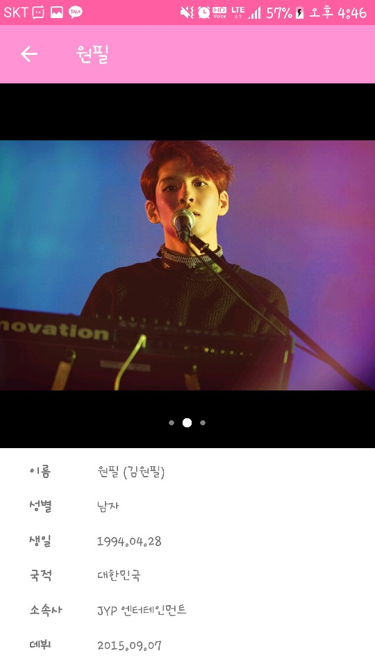

# Dicdol

A toy project for [Kotlin](http://kotlinlang.org) language study.

### Summary

Dicdol is abbreviation of 'Dictionary Idol'. Very simple app that shows k-pop idol group's information.

### Screen Shot

  
  